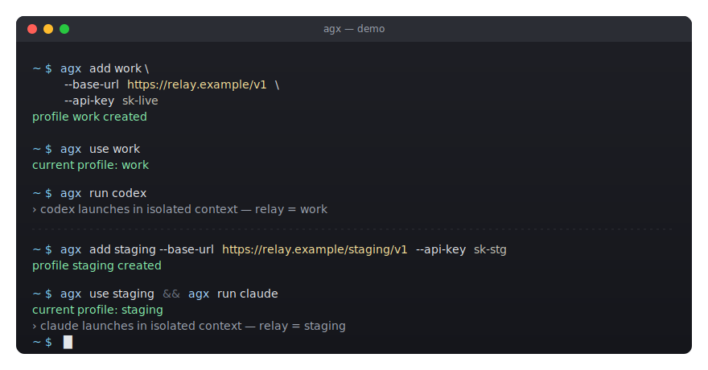

# agx

[](https://github.com/kiddingbaby/agx/actions/workflows/ci.yml)
[](https://pkg.go.dev/github.com/kiddingbaby/agx)
[](https://goreportcard.com/report/github.com/kiddingbaby/agx)
[](go.mod)
[](LICENSE)
[](#install)

<p align="center">
  
</p>

> 一份中转 profile（`base_url` + `api_key`），同步给 `codex` / `claude` / `gemini` / `opencode`，每个 agent 跑在自己的隔离上下文里。

English: [README.en.md](README.en.md) · 用户指南：[docs/user-guide.md](docs/user-guide.md)

---

## Why agx

> 这里说的"中转"= 任意 OpenAI 兼容（`base_url` + `api_key`）的端点：自建网关、第三方代理、LiteLLM 等都算。

在多个 AI coding agent 之间切换中转时，你通常要：

- 手动维护 4 份各家 CLI 的配置文件
  （`~/.codex/config.toml`、`~/.claude/settings.json`、`~/.gemini/.env`、
  `~/.config/opencode/opencode.json`）
- 切换中转时担心改坏其中一份，没有回滚点
- 在不同账号 / 中转 / 模型之间反复编辑同样的字段

agx 把这件事收成 4 个命令：

```bash
agx add  <name>   # 登记一份中转 profile
agx use  <name>   # 切到这份 profile
agx run  <agent>  # 在隔离上下文里启动原生 CLI
agx doctor        # 出问题时给可执行的恢复建议
```

每次写盘前自动快照，失败可整体回滚。所有 agent 共享同一份 profile 模型。

## Quick start

```bash
brew install kiddingbaby/agx/agx

agx add work \
  --base-url https://relay.example/v1 \
  --api-key  sk-live

agx use work
agx run codex      # 任意 agent 都自动用这份中转
agx run claude
```

每个 agent 的配置落在 `~/.config/agx/contexts/<agent>/<name>/`，宿主机的 `~/.codex` / `~/.claude` / `~/.gemini` / `~/.config/opencode` 不被改动。Profile 以 0600 权限的明文 YAML 存在 `~/.config/agx/profiles/`，目前没接 OS keychain。

## Install

一行装好：

```bash
curl -fsSL https://raw.githubusercontent.com/kiddingbaby/agx/main/scripts/install.sh | sh
```

脚本自动选 OS / arch、校验 SHA256，把 agx 装到 `~/.local/bin/agx`。可用 `AGX_INSTALL_DIR=...` 或 `AGX_VERSION=v0.1.0` 覆盖。

挑剔的方式：

- **Homebrew（macOS / Linuxbrew）**：`brew install kiddingbaby/agx/agx`
- **`go install`**：`go install github.com/kiddingbaby/agx/cmd/agx@latest`
- **手动下二进制**：从 [Releases](https://github.com/kiddingbaby/agx/releases/latest) 拿对应平台的 `tar.gz`
- **从源码构建**：见 [CONTRIBUTING.md](CONTRIBUTING.md)

支持 Linux / macOS、amd64 / arm64。

卸载：`brew uninstall agx`（或直接删二进制）；清空所有 profile / 上下文：`rm -rf ~/.config/agx`。

## 常用场景

查看当前状态：

```bash
agx ls         # 列出所有 profile，* 标记当前
agx current    # 只输出当前 profile 名称
```

切换不同中转：

```bash
agx add openai-direct   --base-url https://api.openai.com/v1            --api-key sk-...
agx add anthropic-relay --base-url https://relay.example/anthropic/v1   --api-key sk-...

agx use openai-direct   && agx run codex
agx use anthropic-relay && agx run claude
```

临时挂一个中转，不动默认：

```bash
agx run codex openai-direct -- --help     # 本次启动用 openai-direct；-- 之后的参数转发给 codex
AGX_PROFILE=openai-direct agx run codex   # 本 shell；配合 direnv 可按目录 pin
```

危险编辑前留底，出错回滚：

```bash
agx backup codex                          # 给 codex 当前的 profile 拍快照
agx edit work --api-key sk-rotated
agx run codex
agx restore codex                         # 不对的话回到最近一次 snapshot
```

完整命令参考：[用户指南](docs/user-guide.md)。

## 出问题时

```bash
agx doctor
```

`doctor` 列出所有检测到的问题（含 severity 和 issue code），每条都附**可执行**的修复建议——通常 `agx restore <agent>` 即可。所有 issue code 见 [doctor-issues.zh.md](docs/doctor-issues.zh.md)。

想让 `agx run` 启动前自动留底：

```bash
export AGX_AUTO_BACKUP=1
```

## How it works

```
┌──────────────┐    agx add / edit       ┌─────────────────────┐
│ profile YAML │ ◀────────────────────── │   agx CLI           │
│  store       │                          │                     │
└──────┬───────┘                          └──────────┬──────────┘
       │ resolve                                     │
       ▼                                             │
┌──────────────┐    agx run <agent>                  │
│  derived     │ ◀───────── exec native CLI ◀────────┘
│  per-agent   │            (codex / claude / gemini / opencode)
│  config      │
└──────────────┘
```

- **隔离上下文**：每份配置都在 `contexts/<agent>/<name>/`，宿主机的 dotfile 不动
- **可回滚**：见上方 backup / restore 示例
- **无后台进程**：纯 CLI，只在执行命令期间短暂持有文件锁

架构细节：[docs/ARCHITECTURE.zh.md](docs/ARCHITECTURE.zh.md)。

## Scope

仅处理 **OpenAI 兼容**（`base_url` + `api_key`）形式的中转接入。如果你要的是：

- OAuth 登录、agent 原生 SDK、agent 内置 provider —— 直接用原生 CLI，不需要 agx
- 多人共享配置 / 团队级 secret 管理 —— 不在 scope，agx 是单用户工具

## Status

Pre-1.0。CLI 命令、退出码、JSON 输出和 doctor issue code 已有稳定承诺；内部文件布局尚未冻结——请通过 CLI 而不是直接读 `~/.config/agx/` 内部文件来集成。详见 [兼容性策略](COMPATIBILITY.zh.md) · [CLI 契约](docs/cli-contract.zh.md)。

最近版本：[release notes](docs/release-notes/) · 方向规划：[ROADMAP.zh.md](ROADMAP.zh.md)

## 社区

- 想法 / 讨论：[GitHub Discussions](https://github.com/kiddingbaby/agx/discussions)
- bug / feature request：[GitHub Issues](https://github.com/kiddingbaby/agx/issues)
- 贡献 PR：[CONTRIBUTING.md](CONTRIBUTING.md) · [行为准则](CODE_OF_CONDUCT.md)

## License

[MIT](LICENSE) © 2026 kiddingbaby
